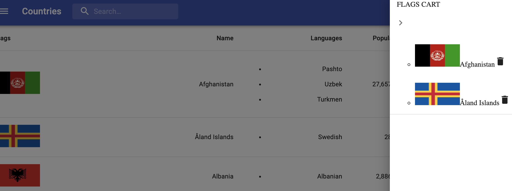
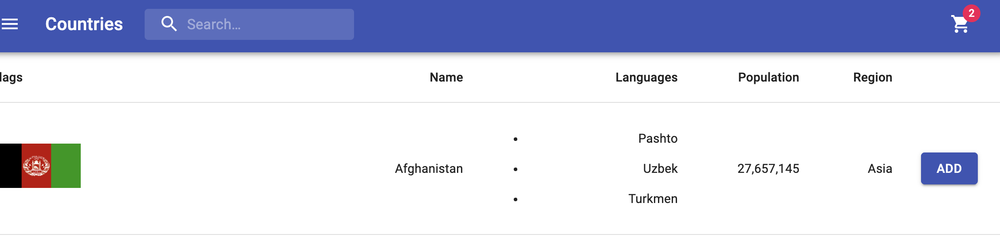

## What I have done so far

- Country fetched and displayed
- Search country from appbar
- Sort by name ( arrow, cursor pointer is missing but name is clickable)
- Add country to cart
- Cart counter flag updates on each addition
- click on cart icon to expand to see countries in cart
- delete a country from cart
- individual routes for each country and history to go back to history page

## What needs to be done

- Theme switch
- Adjust CSS to make styling look better

## Screenshots

#### Home page

#### Filter country / search

#### Country cart

#### Flag counter

